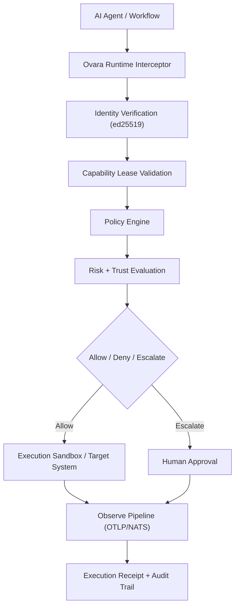

# Ovara

**Runtime trust infrastructure for autonomous systems.**

Ovara sits on the execution path between an autonomous agent and a consequential
action, deciding whether that action should be **allowed**, **denied**, or
**escalated** for human approval — and producing a cryptographic receipt for
every decision.

The first product is **Ovara Runtime**: a low-latency, single-binary Go gateway
that evaluates machine-driven actions (shell, Git, GitHub, CI/CD) and applies
cryptographically-verified capability leases, trust-aware policy, and signed
receipts in microseconds.

> **Security model, stated plainly (2.0):** the gateway is an *enforceable*
> boundary for the actions it executes — enrolled gateway identity, durable
> revocation, claim-time authority recheck, and Ed25519-signed receipts. An
> agent cannot redefine the boundary it acts under. Client-side interceptors
> remain cooperative — an agent that bypasses them is unconstrained. The
> physical boundary — a credential-starving executor proxy where every side
> effect transits a notarizing chokepoint — is described in
> [`docs/architecture/executor_proxy.md`](docs/architecture/executor_proxy.md)
> and ships in [`proxy/`](proxy/).

```text
┌────────────┐   ┌─────────────────────┐   ┌────────────────────┐
│ AI Agent   │──▶│  Ovara Gateway      │──▶│ Target System      │
│ SDK/Code   │   │  • Identity (ed25519)│   │ shell | git | ci   │
└────────────┘   │  • Capability lease │   └────────────────────┘
                 │  • Policy engine    │            │
                 │  • Trust scoring    │            ▼
                 │  • Receipt (Ed25519)│   ┌────────────────────┐
                 └─────────────────────┘   │ Execution Receipt  │
                                           │ (signed, auditable)│
                                           └────────────────────┘
```

---

## Quickstart

One binary runs the whole local deployment — gateway plus executor proxy.

**Install** (requires git + Go 1.25+):

```bash
curl -sSL https://raw.githubusercontent.com/SidianLabs/OVARA/main/install.sh | sh
```

or build from source:

```bash
cd proxy
go build -o ovara ./cmd/ovara
```

**Run:**

```bash
ovara demo            # 30-second self-contained proof, no setup
ovara init mydir      # generates keys, configs, policy, operator token
ovara run -dir mydir  # gateway + executor proxy in one process
```

**Docker** (build context is the repo root):

```bash
docker build -f proxy/Dockerfile -t ovara .
docker run -v ovara-data:/data -p 8080:8080 -p 9443:9443 ovara init /data
docker run -v ovara-data:/data -p 8080:8080 -p 9443:9443 ovara run -dir /data
```

Then wire your agent's environment to the proxy:

```bash
export HTTPS_PROXY=http://localhost:9443
export SSL_CERT_FILE=mydir/var/ca.pem
```

Credentials: export real API keys (`GITHUB_TOKEN`, `OPENAI_API_KEY`, ...) in
the **Ovara process** environment — the agent never sees them. The proxy
injects them at the wire per the host bindings in `proxy.json`.

**What makes it non-advisory:** the agent's environment must have no other
egress. The boundary is built into the binary — run as root:

```bash
ovara run -dir mydir --boundary netns    # creates agent0 netns + nftables deny-all
ovara run -dir mydir --boundary docker   # docker --internal network recipe
```

then run your agent inside it (the command prints the exact `ip netns exec`
line). Without that boundary the proxy is advisory: a cooperative agent uses
it, an uncooperative one routes around it. HTTPS only. Details in
[`proxy/DEPLOYMENT.md`](proxy/DEPLOYMENT.md).

---

## Why Ovara Exists

Cloud IAM, API gateways, workload identity, and observability were built for
humans, deterministic services, predictable control flow, long-lived
credentials, and bounded automation.

**Autonomous systems change the threat model and the execution model.** They
make decisions at runtime, use tools adaptively, operate under delegated
authority, and can drift over long horizons. Existing systems can
authenticate these systems, but they cannot adequately **constrain**,
**explain**, or **revoke** them at the moment of action.

Ovara provides that missing layer.

---

## Product Surface

> **Pre-release software (v0.x).** The gateway core is real and heavily
> tested; packaging, CI, and parts of the surrounding ecosystem are still
> being hardened. Not yet certified for production use.

| Product | Status | Description |
|---------|--------|-------------|
| **Ovara Runtime** | 🟡 Beta | Single-binary Go gateway: interception, policy evaluation, approvals, execution, receipts — the most complete component |
| **Ovara Identity** | 🟡 Beta | Machine identity primitives (ed25519) with capability leases and delegation chains |
| **Ovara Observe** | 🚧 Scaffold | Action lineage & event log today; OTLP/NATS telemetry + ClickHouse analytics planned (not wired — see `observability/README.md`) |
| **Ovara Shield** | 🟡 Beta | Anomaly signals, trust degradation, containment hooks |
| **Ovara Cloud** | 🔶 Alpha | Hosted control plane, gateway enrollment, policy distribution, multi-tenant — partially implemented |
| **Ovara Federation** | 🔶 Alpha | Cross-organization trust graph with portable receipts — partially implemented |
| **Ovara SDKs** | 🟡 Beta | TypeScript (`@ovara/sdk`) and Python (`ovara-sdk`) with portable verification |
| **Ovara Integrations** | 🔶 Alpha | CrewAI, OpenAI Agents, OpenAI, LangChain, MCP, Browser Automation |
| **Ovara Admin** | 🔶 Alpha | Next.js dashboard for gateway monitoring, policy editor, audit log |

---

## What You Get

### 12 Execution Surfaces

`shell` · `exec` · `git.push` · `git.pull` · `git.fetch` · `git.checkout` ·
`github.push` · `github.pr` · `github.merge` · `github.delete_branch` ·
`ci.trigger` · `shell.sandboxed` (opt-in via `OVARA_SANDBOX_ENABLED=true`)

### Cryptographic Identity

- **ed25519** key pairs for `AgentIdentity` (asserted identity; see security model note above)
- Signed **CapabilityLease** with TTL and delegation depth — verified against a
  **trusted-issuer key registry** (`trusted_issuers` in config), never against
  keys carried in the request
- **SHA-256 hash lineage** for `DelegationChain` (integrity check, not proof of authority)
- Unsigned or unknown-issuer leases are rejected

### Trust-Aware Security

- **Drift detection** — sliding-window action pattern analysis
- **Trust degradation** — exponential decay with streak acceleration
- **Chain detection** — self-delegation, depth, rapid re-delegation
- **Trust-dependent policy rules** — `MinTrustScore`, `MinTrustLevel`

### Cryptographic Receipts

- **Ed25519 gateway signatures** (`edsig_v1:<hex>`) over the full decision
  record — verifiable offline with `gwctl verify-receipt` using registry
  public material only (no private key or HMAC secret needed)
- **HMAC-SHA256** signing with deterministic action digests (`sig_v1:<hex>`)
- Historical receipts stay verifiable across gateway key rotation and
  revocation — public-key records are retained for verification even when
  the key is no longer live for authentication
- File-backed archival with retention

### Cross-Domain Action Lineage

- **Signed lineage bundles** (`lin_v1`) emitted at each authority
  boundary — decision, approval, execution — carrying the edsig receipt
  + presented delegation chain + lease + approver-signed approval
  envelope, each digest registered on a transparency ledger
  (SCITT-shaped inclusion countersignatures under a separate ledger
  root; `lineage_file` / `lineage_ledger_file` / `lineage_ledger_key_file`)
- **Offline verification** (`internal/lineage.Verify`): a counterparty
  verifies a bundle against a pinned anchor — gateway, issuer, approver,
  and ledger keys plus a revocation snapshot — without contacting the
  issuing domain. An OVARA-verified party can prove where an action's
  authority came from, offline, even if the issuing domain is later
  hostile. Format and honest limits: `docs/ACTION_LINEAGE.md`

### Gateway Trust & Revocation (2.0)

- **Gateway enrollment** — PoP-bound gateway keys admitted to a durable,
  hash-chained registry before the gateway serves; unenrolled gateways
  refuse to boot into the trusted path
- **Durable revocation** — issuer, delegation-hop, and lease revocation
  persisted in a journal with a monotonic trust epoch
- **Claim-time authority recheck** — authority is revalidated at the claim
  linearization point; pre-claim revocation denies with zero execution
- **Identity/credential lifecycle** — registered credentials with rotation
  grace, suspend/resume/retire; suspended or retired subjects' queued work
  never executes

### Operational Tooling

- Operator bearer-token auth, bulk retry/cancel, unified pagination
- SLA health diagnostics, stuck-executing recovery, panic recovery
- Batch check endpoint (`POST /v1/runtime/batch-check`)
- File-backed stores with configurable retention
- Structured JSONL event/decision logs (`/var/data/*.jsonl`), `GET /v1/events`, `GET /v1/runtime/metrics`
- *Planned (not wired yet):* OTLP/NATS telemetry pipeline, Prometheus `ovara_*` metrics — see `observability/README.md`

### Production Hardening

- AppArmor mandatory access control profile
- eBPF ring-buffer syscall interceptor
- Seccomp syscall allowlist (~130 syscalls)
- Firecracker microVM sandbox config
- Terraform K8s manifests (single-region deployable; multi-region layout in `regions.tf` is scaffolded but not wired — modules commented out)
- systemd, Docker, and Docker Compose deployment

---

## Performance (Apple M4)

| Operation | Latency |
|-----------|---------|
| Policy-only decision (httptest, in-process) | ~9.7 µs |
| Decision with identity | ~10.7 µs |
| Decision with trust anomaly | ~10.7 µs |
| Full identity+lease decision | ~12.9 µs |
| Evaluator (no HTTP) | ~2.7 µs |
| HMAC-SHA256 sign | ~620 ns |
| HMAC-SHA256 verify | ~650 ns |
| Decision cache get/put | ~39-40 ns |

~10-13µs decision path and ~115k decisions/sec on loopback (see `docs/BENCHMARKS.md`) — fast enough for inline interception in agent workflows.

---

## Quick Start (standalone gateway — advanced)

The unified CLI above is the common path. This section runs the advisory
gateway alone; the standalone proxy binary is `proxy/cmd/ovara-proxy`.

### Run the Gateway

```bash
git clone https://github.com/SidianLabs/OVARA.git
cd OVARA/runtime/gateway
go build -o ovara-gateway ./cmd/server
./ovara-gateway                              # uses etc/config.json
OVARA_CONFIG=./etc/config.json ./ovara-gateway
```

The gateway starts on `:8080` with the bundled policy in `etc/`. To issue
your first decision:

```bash
curl -X POST http://localhost:8080/v1/runtime/check \
  -H "Content-Type: application/json" \
  -d '{
    "action_type": "shell",
    "resource": "shell:git push origin main",
    "agent_identity": { "issuer": "ovara", "subject_id": "agt_001" },
    "environment": "dev",
    "nonce": "'$(uuidgen)'",
    "issued_at": "'$(date -u +%Y-%m-%dT%H:%M:%SZ)'"
  }'
```

### Use the TypeScript SDK

The SDK is not yet published to npm — install it from the repo:

```bash
npm install ./sdk/typescript
```

```typescript
import { OvaraClient } from '@ovara/sdk';

const client = new OvaraClient({
  baseUrl: 'http://localhost:8080',
  agentId: 'agt_001',
  token: process.env.OVARA_TOKEN,
});

const decision = await client.check({
  action_type: 'shell',
  resource: 'shell:git push origin main',
  environment: 'dev',
});

if (decision.decision === 'allow') { /* proceed */ }
if (decision.decision === 'escalate') { /* request approval */ }
```

### Use the Python SDK

The SDK is not yet published to PyPI — install it from the repo:

```bash
pip install ./sdk/python
```

```python
from ovara_sdk import OvaraClient

client = OvaraClient(base_url="http://localhost:8080", agent_id="agt_001")
decision = await client.check(
    action_type="shell",
    resource="shell:git push origin main",
    environment="dev",
)
```

### Run the Demos

```bash
cd examples
./start_gateway.sh        # in another terminal
./demo_safe_shell.sh
./demo_approval_flow.sh
./demo_restricted_agent.sh
```

---

## Architecture



### Core Primitives

Everything in Ovara builds around five primitives:

- **`AgentIdentity`** — the stable identity of a machine actor
- **`CapabilityLease`** — a short-lived, scoped delegation of authority
- **`DelegationChain`** — the verifiable lineage of authority transfer
- **`TrustContext`** — the current posture used during authorization
- **`ExecutionReceipt`** — the signed record of a decision and resulting action

---

## Monorepo Structure

```
ovara/
├── apps/admin-dashboard/   # Next.js admin UI
├── cloud/control-plane/    # Hosted control plane (Fastify + Drizzle + PostgreSQL)
├── docs/                   # User-facing documentation
├── enterprise/             # SSO (OIDC/SAML), compliance reports
├── examples/               # Sample configs, demo scripts
├── identity/               # Standalone Go module: ed25519 primitives
├── infrastructure/         # Terraform, Docker Compose
├── integrations/           # CrewAI, OpenAI, LangChain, MCP, browser-automation
├── observability/          # Grafana dashboards, Prometheus alerts
├── packages/               # Cross-language shared types
├── policy/                 # OPA/Cedar adapters, policy compiler
├── proxy/                  # Executor proxy + unified `ovara` CLI (init/run/demo)
├── research/               # Research notes
├── runtime/gateway/        # The main Go gateway
├── sdk/                    # TypeScript and Python SDKs
├── security/               # AppArmor, eBPF, Seccomp, Firecracker profiles
├── services/               # Microservices (approval, alerting, observability, etc.)
├── telemetry/              # NATS collector, ClickHouse schema
├── tools/                  # CLI, migration tool, benchmark tool
└── trust/                  # Federated trust graph and CLI
```

---

## Delivery Phases

| Phase | Title | Status |
|-------|-------|--------|
| 1 | Runtime interception for shell, GitHub, and CI/CD | ✅ |
| 2 | Machine identity, capability leases, signed provenance | ✅ |
| 3 | Trust-aware authorization, drift detection, anomaly-informed escalation | ✅ |
| 4 | Hosted cloud platform, regional gateways, enterprise policy distribution | ✅ |
| 5 | Federated machine identity and portable trust infrastructure | ✅ |
| 6 | SDKs (TypeScript, Python) and framework integrations | ✅ |
| 7 | Production hardening, observability, observability microservices | ✅ |

See [`docs/build/`](docs/build/) for the per-phase checkpoint documents.

---

## Validation

```bash
# All Go modules: build, vet, test, race
make check

# Specific module
cd runtime/gateway && go test -race -count=1 ./...
cd identity && go test -race -count=1 ./...
cd trust && go test -race -count=1 ./...

# TypeScript modules
cd cloud/control-plane && npm test
cd enterprise/sso && npm test
cd enterprise/compliance && npm test
cd sdk/typescript && npm test
cd apps/admin-dashboard && npm test

# Python SDK
cd sdk/python && pytest
```

**Current state:** 1,200+ test functions across 30+ packages, 0 data races,
100% TS strict mode compliance, 70+ Python test cases.

---

## Documentation Map

- Vision: [docs/vision](docs/vision)
- Product requirements: [docs/prd](docs/prd)
- Architecture: [docs/architecture](docs/architecture)
- API reference: [docs/api](docs/api)
- Security: [docs/security](docs/security)
- Operations: [docs/operations.md](docs/operations.md)
- Deployment: [docs/deployment.md](docs/deployment.md)
- Developer: [docs/developer](docs/developer)
- Research: [docs/research](docs/research)
- RFCs: [docs/rfc](docs/rfc)
- ADRs: [docs/adr](docs/adr)
- Build phases: [docs/build](docs/build)

---

## Contributing

We welcome contributions. See [CONTRIBUTING.md](CONTRIBUTING.md) for the
workflow, [CODE_OF_CONDUCT.md](CODE_OF_CONDUCT.md) for community norms,
and [SECURITY.md](SECURITY.md) for vulnerability disclosure.

This project follows strict **test-driven development** for all production
code — write the test first, watch it fail, then write the minimum code
to pass.

---

## License

Apache License 2.0 — see [LICENSE](LICENSE).

Copyright 2026 SidianLabs.
