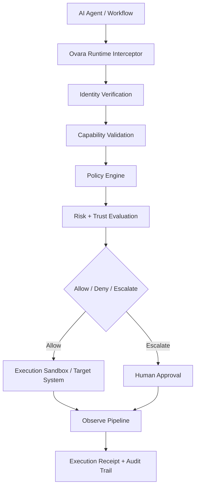

# Ovara

Ovara is runtime trust infrastructure for autonomous systems.

It sits on the execution path between an autonomous agent and a consequential
action, deciding whether that action should be allowed, denied, or escalated.
The first product is Ovara Runtime: a low-latency interception and
authorization layer for machine-driven actions such as shell execution, GitHub
mutation, and deployment workflows.

## Platform Thesis

The software stack has a missing layer.

Cloud IAM, API gateways, workload identity, and observability were built for:

- humans
- deterministic services
- predictable control flow
- long-lived credentials
- bounded automation

Autonomous systems change the threat model and the execution model. They make
decisions at runtime, use tools adaptively, operate under delegated authority,
and can drift over long horizons. Existing systems can authenticate these
systems, but they cannot adequately constrain, explain, or revoke them at the
moment of action.

Ovara exists to provide that missing layer.

## Product Surface

- `Ovara Runtime`: interception, policy evaluation, approvals, execution
  receipts
- `Ovara Identity`: machine identity, delegated capability leases, provenance
- `Ovara Observe`: action lineage, traces, telemetry, auditability
- `Ovara Shield`: anomaly signals, trust degradation, containment hooks
- `Ovara Cloud`: hosted control plane and regional runtime infrastructure

## Initial Wedge

Ovara should not try to secure every autonomous action domain at once.

The initial production wedge is:

- shell command execution
- GitHub and Git mutation actions
- CI/CD deployment actions
- human approval for high-risk actions

These surfaces are painful, high-value, and already common in agentic coding
and DevOps workflows. They are enough to prove the platform without diluting
focus across browsers, payments, databases, and enterprise identity federation
at the same time.

## Core Primitives

Everything in Ovara builds around five primitives:

- `AgentIdentity`: the stable identity of a machine actor
- `CapabilityLease`: a short-lived, scoped delegation of authority
- `DelegationChain`: the verifiable lineage of authority transfer
- `TrustContext`: the current posture used during authorization
- `ExecutionReceipt`: the signed record of a decision and resulting action

If these primitives are poorly defined, the platform becomes governance
language. If they are well-defined, the platform becomes infrastructure.

## Monorepo Shape

```text
ovara/
├── apps/
├── cloud/
├── docs/
├── enterprise/
├── examples/
├── identity/
├── infrastructure/
├── integrations/
├── observability/
├── packages/
├── policy/
├── research/
├── runtime/
├── sdk/
├── security/
├── services/
├── telemetry/
├── tools/
└── trust/
```

## Architecture At A Glance



## Delivery Phases

1. ✅ Runtime interception for shell, GitHub, and CI/CD with approvals and receipts — **complete**
2. ✅ Machine identity, delegated capability leases, and signed provenance — **complete**
3. Trust-aware authorization, drift detection, and anomaly-informed escalation
4. Hosted cloud platform, regional gateways, enterprise policy distribution
5. Federated machine identity and portable trust infrastructure

## Current State

**Phase 1** exit criteria are met:
- 5 execution surfaces: `shell`, `exec`, `git.push`, `git.pull`, `git.clone`
- Policy engine with allow/deny/escalate and dynamic approvals
- Cryptographic receipt signing (HMAC-SHA256, sig_v1)
- Operator bearer-token auth, bulk retry/cancel, unified pagination
- SLA health diagnostics, stuck-executing recovery, panic recovery

**Phase 2 — Machine Identity**:
- 4 identity primitives: `AgentIdentity`, `CapabilityLease`, `DelegationChain`, `TrustMetadata`
- All primitives use ed25519 signing with deterministic digests
- Agent registry (suspend/revoke/lifecycle), capability lease store, issuer service
- Cryptographic CapabilityLease signature verification wired into gateway evaluator
- `identity/` module: 66 test cases, 0 data races

**Validation**: 22/22 gateway packages + identity module passing under `go test -race`

## Documentation Map

- Vision: [docs/vision](/Volumes/Portable%20Mac/ovara/docs/vision)
- Product requirements: [docs/prd](/Volumes/Portable%20Mac/ovara/docs/prd)
- Architecture: [docs/architecture](/Volumes/Portable%20Mac/ovara/docs/architecture)
- Build system: [docs/build](/Volumes/Portable%20Mac/ovara/docs/build)
- API standards: [docs/api](/Volumes/Portable%20Mac/ovara/docs/api)
- Security: [docs/security](/Volumes/Portable%20Mac/ovara/docs/security)
- Developer docs: [docs/developer](/Volumes/Portable%20Mac/ovara/docs/developer)
- Research: [docs/research](/Volumes/Portable%20Mac/ovara/docs/research)
- RFCs: [docs/rfc](/Volumes/Portable%20Mac/ovara/docs/rfc)
- ADRs: [docs/adr](/Volumes/Portable%20Mac/ovara/docs/adr)
