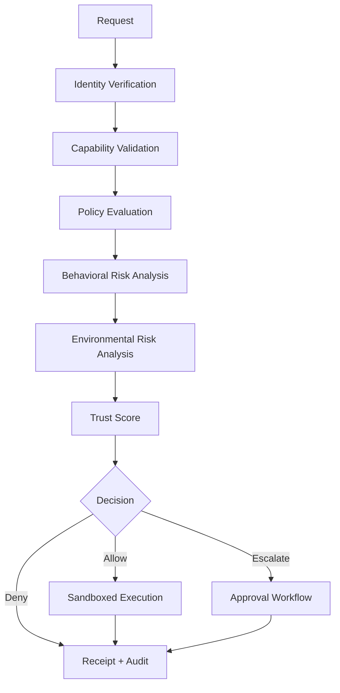

# Execution Model

## Principles

- the decision must happen before the side effect
- the receipt must be immutable after the decision
- the execution environment should be independently observable

