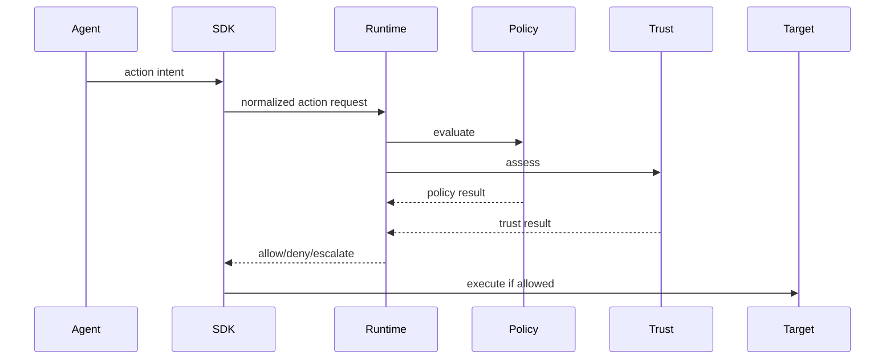

# Runtime Architecture

## Core Components

- interceptors embedded in SDKs and adapters
- runtime gateway for normalization and decision orchestration
- policy evaluator
- trust/risk evaluator
- receipt emitter

## Execution Path

## Runtime Models Considered

- middleware model: fastest to adopt inside existing agent frameworks
- sidecar model: stronger isolation, best for long-running services
- gateway model: central governance and richer observability
- eBPF hooks: powerful, but better as later enhancement for kernel-level events

Recommendation:

- start with SDK + gateway model
- add sidecar for enterprise deployments

