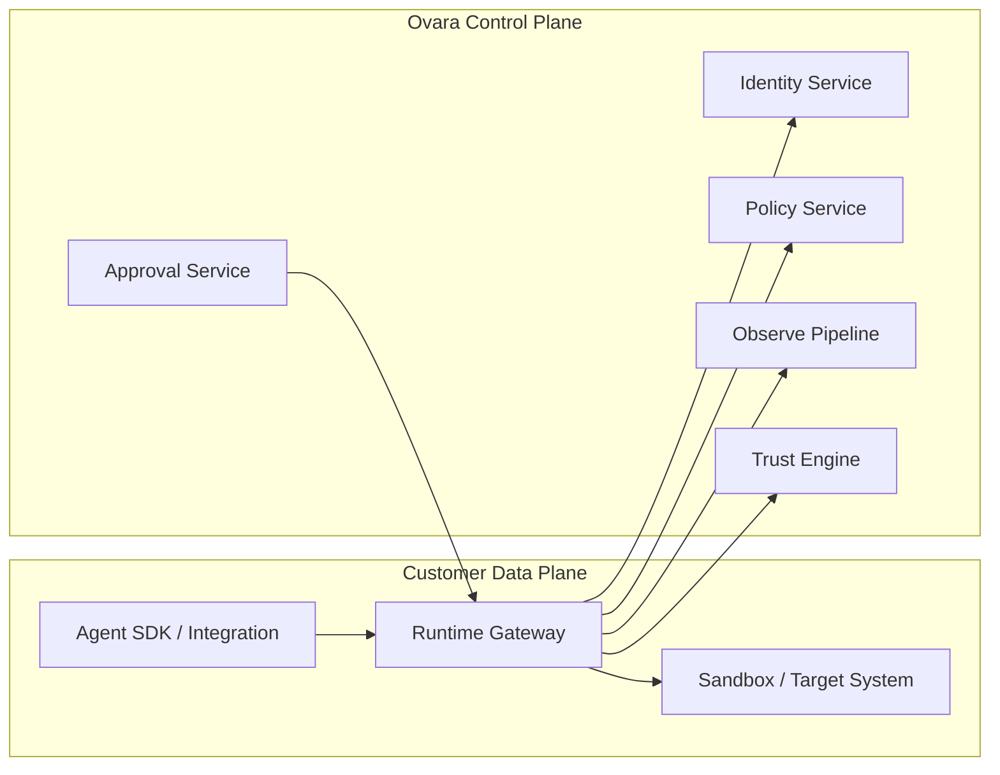

# System Architecture

## Overview

Ovara is built as a split control-plane and data-plane system.

## Architectural Split

- data plane handles action interception and low-latency decisions
- control plane manages policies, identities, approvals, analytics, and trust

## Near-Term Shipping Topology

The first shipping topology should be intentionally simple:

- interceptor embedded in SDK or integration adapter
- local or nearby runtime gateway on the customer side
- hosted control plane for policy, approval, and receipt storage

This topology minimizes adoption friction while preserving a hard execution
control point.

## Design Constraints

- the runtime gateway must keep operating during control-plane degradation using
  pinned policy and identity state where safe
- revocation and approval continuation are strong-consistency paths
- analytics and long-horizon telemetry are asynchronous paths
- no critical mutation should depend on a best-effort logging pipeline

## Trust Boundaries

- untrusted or semi-trusted agent process
- trusted interceptor and gateway boundary
- strongly authenticated control-plane calls
- separately trusted target system boundary

## Failure Semantics

- if policy cannot be evaluated for a production mutation, default deny
- if receipt persistence fails after a decision, the action outcome must still
  be recoverable through idempotent reconciliation
- approval decisions must be signed and bound to a specific action digest

## Stack Direction

- Rust for hot path runtime and security-sensitive components
- Go for gateway and distributed systems where team velocity matters
- TypeScript for control plane APIs, SDKs, CLI, and developer tools
